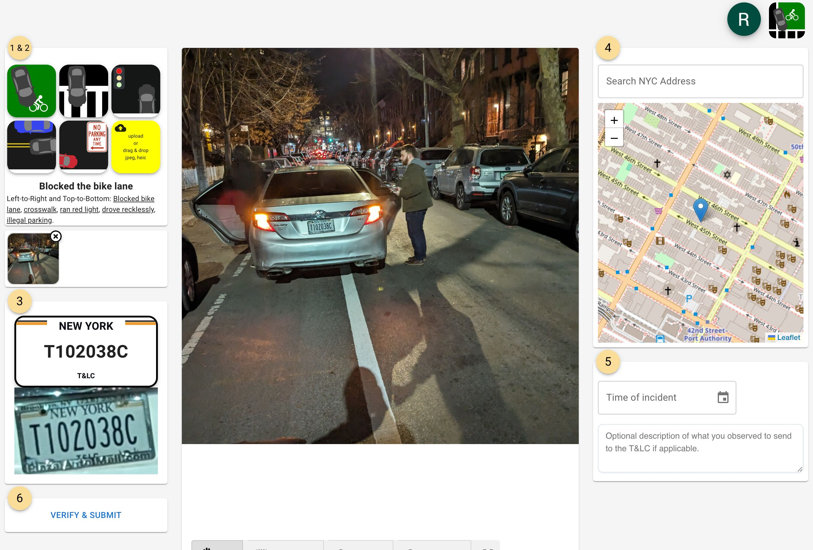

# Reported - NYC 311 & NY TLC Complaint Simplifier

## About
This web app focuses on bridging the gap between NYC 311 and NY TLC. It simplifies the process of reporting reckless driving or other infractions by requiring only a photo of the incident. If safely possible, include the license plate in the photo.

Demo can be found [here](https://snooplsm.github.io/reported-plates)

The app automatically extracts:
- **License Plate** information
- **Date of Incident**
- **GPS Coordinates**

Once these data points are collected, simply choose the appropriate **complaint type**, and the app will handle the rest. The report is funneled into the appropriate channels for **311**, **TLC**, or **NYPD** to address.

Thank you for helping to make our streets safer by holding reckless drivers accountable!

---

## Steps to Run

1. Install dependencies:
   ```bash
   npm install
   ```

2. Start the development server:
   ```bash
   npm run dev
   ```

---

## TODO
- Clean up linting errors

---

## Join the Cause
We need your help! Join our **Slack community** to collaborate, share feedback, and contribute to making this project better.

**Slack Invite Link**: [Join Here](https://join.slack.com/t/reportedcab/shared_invite/zt-2xz2lt5np-9_3CzYUI0X4iGI2OLOZc0g)

---

## Visualize



## License
This project is licensed under the MIT License. Feel free to contribute and improve the project for the community.
